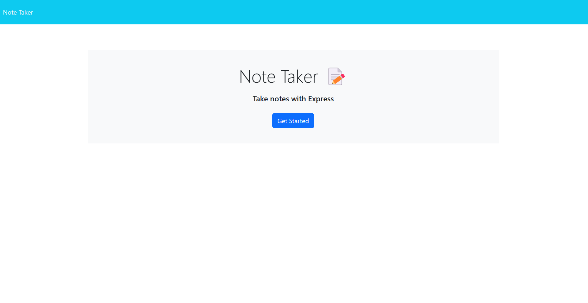
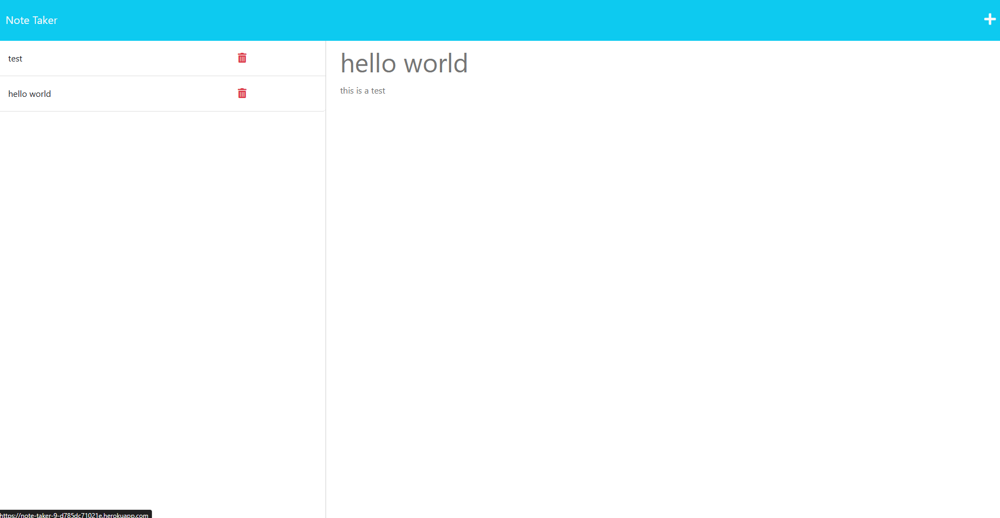

# Note Taker

## Description
This is a note taker application, that uses express for the server and routing, and node for the functionality. Its "database" is a db.json file.

## Tech
* HTML
* CSS
* JavaScript
* Node.js
* Express.js
* uuid()

## Links
[GitHub Repo](https://github.com/Fuzzy-Codes/Note-Taker)\
[Heroku URL](https://note-taker-9-d785dc71021e.herokuapp.com/notes)

## Screenshots

